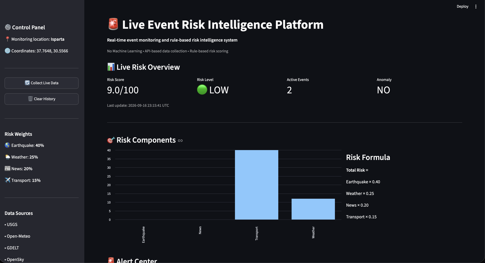
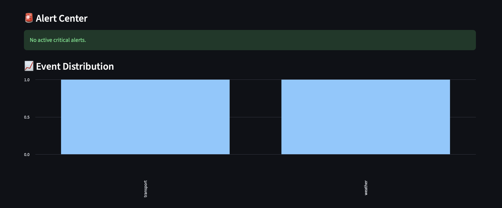
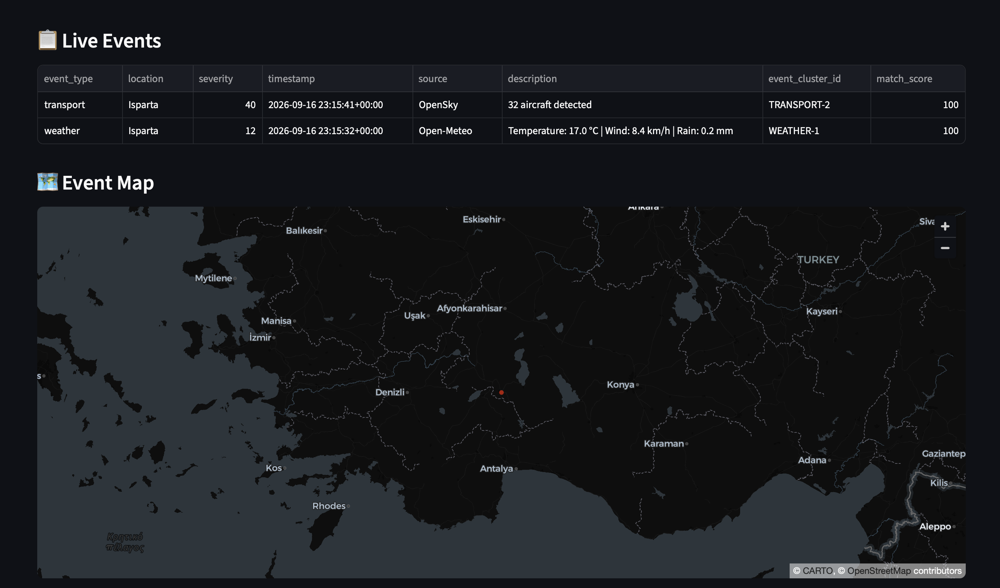
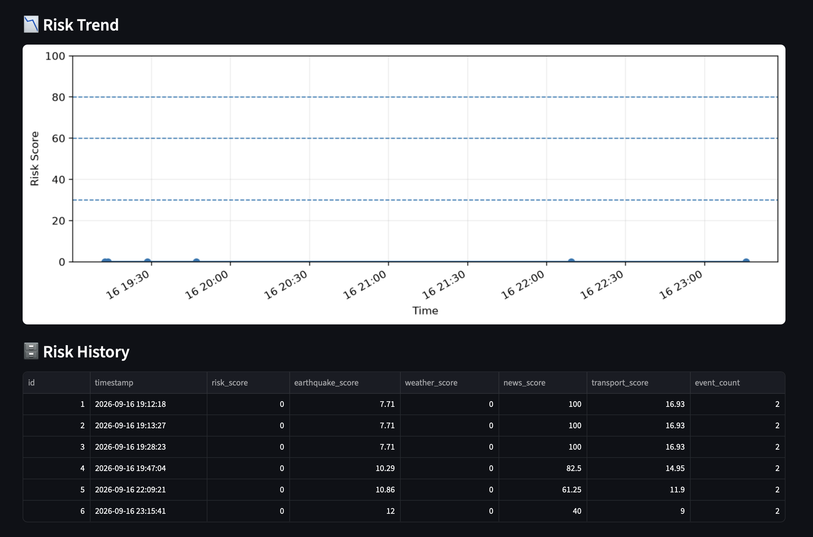

cat > README.md <<'EOF'
# 🌍 Live Event Risk Intelligence Platform

Gerçek zamanlı dış veri kaynaklarını bir araya getirerek bölgesel olayları analiz eden ve kural tabanlı risk skoru üreten bir veri analizi ve karar destek platformudur.

## 🚀 Proje

Platform; deprem, hava durumu, haber ve ulaşım verilerini toplar, analiz eder ve 0-100 arasında bir risk skoru oluşturur.

## 📊 Veri Kaynakları

- 🌎 USGS Earthquake API
- 🌤️ Open-Meteo Weather API
- 📰 GDELT News API
- ✈️ OpenSky Network API


## 📊 Dashboard Preview

The platform provides a real-time dashboard for monitoring events and calculating rule-based risk scores.

### Risk Overview



### Alert Center & Event Distribution



### Live Events & Event Map



### Risk Trend & History




## 🧠 Risk Modeli

Risk skoru dört ana bileşenden oluşturulur:

| Bileşen | Ağırlık |
|---|---:|
| Deprem | %40 |
| Hava Durumu | %25 |
| Haber | %20 |
| Ulaşım | %15 |

### Risk seviyeleri

- 🟢 0-29 → Düşük
- 🟡 30-59 → Orta
- 🟠 60-79 → Yüksek
- 🔴 80-100 → Kritik

## 🛠️ Kullanılan Teknolojiler

- Python
- Streamlit
- Pandas
- NumPy
- Requests
- Matplotlib
- RapidFuzz
- SQLite

## 📁 Proje Yapısı

```text
live-risk-platform/
│
├── app/
│   ├── streamlit_app.py
│   └── streamlit_app_backup.py
│
├── data/
│
├── src/
│   ├── collectors/
│   ├── models/
│   ├── utils/
│   └── visuals/
│
├── notebooks/
│
├── requirements.txt
├── README.md
└── .gitignore